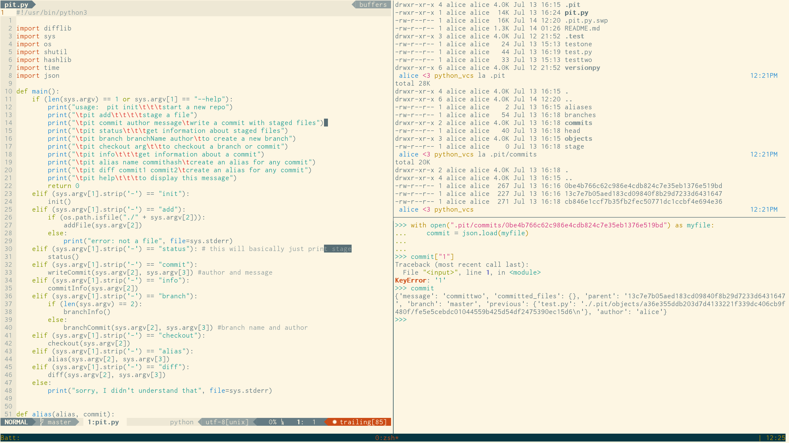

#What is a tmux?

Tmux is a terminal multiplexer, which basically means it's a way to have
multiple terminal sessions live inside of a single terminal window. This is
super handy! It lets us do things like:

Here I have Vim open on the left, and on the right I have a shell up top
and a python interpreter on the bottom. Tmux lets me switch between all of
these 'panes' using the keyboard.

#Installing!

###Mac OS

To get tmux on Mac OS you need homebrew already installed, and then you
can just do:

    brew install tmux

that should be it!

###Linux

I think tmux should be in the repos for just about every Linux distro (I
know it is for Arch and Debian).

#Configuration

To configure tmux we can put stuff in `~/.tmux.conf`. As a quick example
let's add mouse support! We do:

    set-window-option -g mode-mouse on
    set-option -g mouse-select-pane on
    set-option -g mouse-select-window on
    set-option -g mouse-resize-pane on
    setw -g mode-mouse on

Keybindings are great, but mouse support is sometimes super handy!

#Create a tmux session

If you want to start tmux we do:

    tmux new

If you run this in a terminal you'll probably get a bar drawn along the
bottom, but otherwise it will be pretty unexciting.

We can give our tmux session a name by doing:

    tmux new -s 'name'

This will come in handy later! On my machine I always name my tmux
instances, so I use this alias a lot:

    alias new='tmux new -s'

then I just do `new python` or `new todo` or some such thing. Nice!

#Command Prefix

Tmux is controlled mostly from the keyboard. Although we enabled mouse
support above, we can't use the mouse to make new panes or windows. If we
want to enter a command in tmux we first hit the `prefix` keybind, which
by default is `ctrl-b`. I don't particularly like this, so I have mine
bound to `ctrl-w`, but you can do whatever you like! Some folks use
`ctrl-a`, but this interferes with readline.

To bind a custom prefix:

    unbind C-b #get rid of the default
    set -g prefix C-w
    bind C-w send-prefix

And that's it! `C` is tmux-speak for `ctrl`.

#Detaching and Attaching

One of the coolest features of tmux is that we can 'detach' from a running
tmux session, and it will continue to run in our absense. To detach we do
`prefix-d`, which means hit prefix, release the keys, and then type
`d`. Cool! This is sort of like using `C-z` to suspend Vim, but we
could be suspending a whole number of virtual terminals. Nifty!

On a related note we can get a list of running tmux sessions by doing:

    tmux list-sessions

this is why I like to name them: if the tmux sessions have names then it's
easier to tell them apart if you have multiple ones running (I usually do
because I'm messy).

We can also reattach to a running session by doing:

    tmux attach -t 'session name'

I have this aliases to `attach`. This will plop us back into the tmux
session we started earlier, and everything we had open will still be
there.

This is super super handy! Where tmux becomes really useful is when
interacting with other computers over ssh: if you're doing your work in
a tmux session you don't need to fear network problems! If your ssh
connection is interrupted you will be able to reattach right back where
you were.

This also applies to accidentally closing a terminal window on your
machine! Nice.

#Command mode

Tmux has a command mode that is kind of similar to Vim's. Basically if you
do `prefix-:` you'll be at a little prompt where you can try out tmux
commands. There are lots of tmux commands! We're going to start learning
more of them and creating keybinds, command mode lets you try out
a command to see what it does.

#Create new panes

Tmux starts with only one pane occupying the whole of the window. We can do
better! The command to do do a split so that we have two panes is:

    split-window

This will split it in half horizontally, so the result is two windows, one on
the top and one on the bottom. By default this is bound to `"`, which I haven't
found to be a terribly useful binding. If you want to rebind it you can do

    bind u split-window

(I use `u`, but you don't have to!). We can also split a pane in the other
direction, so that we get a split into two panes next to each other. We get
this behavior from the `-h` flag, like this:

    split-window -h

this is bound by default to `%`. I use `o` for it.

###Path weirdness

Tmux, by default, doesn't handle working directory in the way that I think it
should. If you start a tmux session in `~/mydir`, and then move from there to
`~/mydir/mybetterdir`, the working directory for new splits will still be
`~/mydir`. We can solve this by using this instead:

    split-window -c "#{pane_current_path}"

Hooray! Credit for that one goes to Steve McCarthy. If we throw a `-h` option
in there as well we'll get the same behavior we did before.)`

#Destroy panes

DESTROY! We can of course do this. If you bind a key to:

    kill-pane

that will close the currently focused pane (the one your cursor is in). If
you kill the last active pane, tmux will die (sad).

#Move between panes

OK, so once we have splits that we're working with (maybe Vim on the left
and a REPL on the right) we need to move around. We enabled mouse support
above, so really we could just click around, but we're badass hackers,
right? right?

OK well anyway, we can move relatively between panes using the
`select-pane` command. I bind `hjkl` to this, for Vim-ness. The arrow keys
are bound by default.

    bind h select-pane -L
    bind j select-pane -D
    bind k select-pane -U
    bind l select-pane -R

Nice! If you're a vim user that will be nice and comfy.

#Resize panes

It's possible to change the size of the splits using keybinds, but I just
use the mouse. You should be able to just click on the border and drag to
resize.

#Make new window

Tmux has some terminology attached: everything we've done so far has taken
place in one window. We've made 
